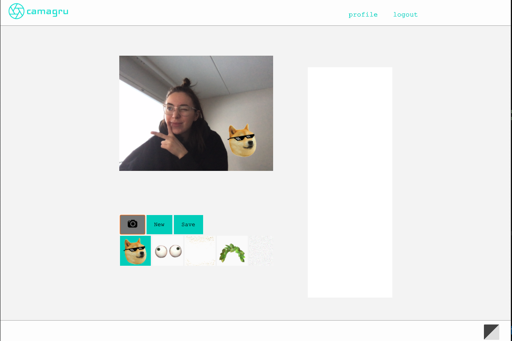
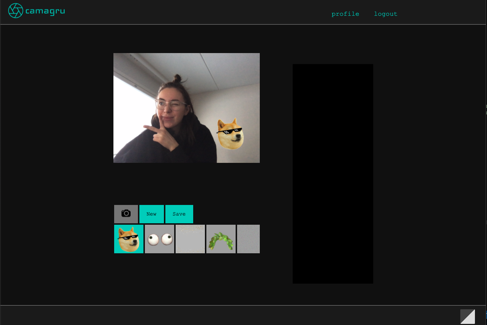

# camagru

IN PROGRESS..

"In this projects you will create, in PHP, a small Instagram-like site
that enables users to make and share photo edits. You will thus implement, with bare hands (frameworks are forbidden),
basic functionalities you find on most sites with a user database."

As a bonus, I have implemented dark/light mode feature.

Objectives
- Users management
- Permissions management
- Mailing
- Security / Data validation

Skills
- Security
- DB & Data
- Web

Build with:
- HTML
- CSS
- Javascript
- PHP
- SQL with PDO
- Ajax

