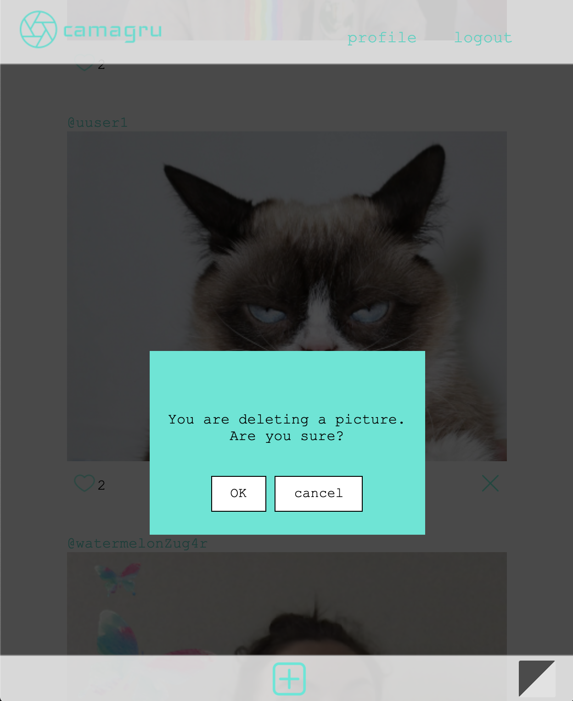

# camagru

"In this projects you will create, in PHP, a small Instagram-like site
that enables users to make and share photo edits. You will thus implement, with bare hands (frameworks are forbidden),
basic functionalities you find on most sites with a user database."

When user registers, the app is sending verification mail to users email. After the account has been verified, user can login and start like others pictures and add own pictures aswell. 
If user forgots a password he can ask a unique password reset link which is sent to his email from login page (there's a link "did you forgot your password").
User can edit his username, password and email. Notification is sent every time user's picture has a new like. You can also choose to set notifications off in account editing page.
User can delete his own pictures when logged in.

As a bonus, I have implemented dark/light mode feature and allowing user to dragg stickers when taking a photo.

Objectives
- Users management
- Permissions management
- Mailing
- Security / Data validation

Skills
- Security
- DB & Data
- Web

Build with:
- HTML
- CSS
- Javascript
- PHP
- SQL with PDO
- Ajax

If you want to try this app, first you have to download bitnami MAMP local server environment(for macOS). Clone this repository to htdocs folder (mamp/apache2/htdocs/) and name it Camagru so the email links work correctly. Remember to configure mail settings correctly in php.ini mail sections. 
In the root of the repository run the command 'php config/setup.php' so it creates the database for the app. It adds couple fake users aswell so the gallery isn't empty.
Now you can start using the app. Use Chrome or Firefox, the url looks something like this 'http://127.0.0.1:8888/camagru/index.php'.

Login page (dark mode and narrow screen)

Register (dark mode and narrow screen)

Your own profile (light mode and big screen)

Account editing (light mode and big screen)

Editing page to take and upload photos (light mode and big screen)

Gallery showing all the images with pagination (pictures with both modes and narrow and big screen)

Deleting photo

